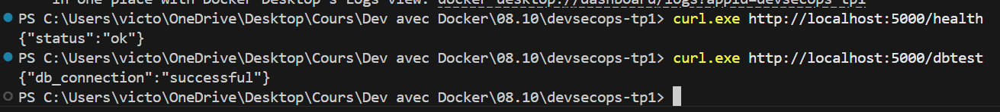

# Hardening Flask & PostgreSQL

Binôme : **Victor** & **Kylian**

Architecture : une API Flask (`api-python`) et une base PostgreSQL (`db`).

- La base n'est reliée qu'au réseau `backend` et ne publie aucun port.
- L'API est reliée à `backend` et à `frontend` (port 5000).
- Le pipeline GitHub Actions valide le code, l'image et la composition, puis publie l'image sur GHCR.

## 1. Liens GHCR

- Package : https://github.com/victorwmb/devsecops-tp1/pkgs/container/devsecops-tp1
- Commande : `docker pull ghcr.io/victorwmb/devsecops-tp1:1.0.0`

## 2. Avant / Après

| | API avant | API après | BDD avant | BDD après |
|---|---|---|---|---|
| Image | python:3.10-slim | Chainguard Python | postgres:14-alpine | Chainguard Postgres |
| Poids | 167,9 Mo | 96,3 Mo | 299,2 Mo | 396,5 Mo |
| Utilisateur | root | nonroot | postgres | postgres |
| Shell | oui | non | oui | oui (entrypoint) |
| CVE (Trivy) | 185 | 0 | 47 | 0 |
| Dive | 97,35 % | 99,73 % | 99,89 % | 99,86 % |

## 3. Images de base

- **Chainguard plutôt que Distroless** : Chainguard (base Wolfi) est mise à jour plus vite que Distroless (base Debian) et vise 0 CVE. Elle est la même famille que l'image Postgres imposée.
- **Variante de build** : `latest-dev` (avec pip) a le même Python que `latest` (sans shell ni pip). Les dépendances installées dans le builder fonctionnent donc directement dans l'image finale.
- **Immuabilité** : toutes les images sont épinglées par digest SHA256 et les dépendances Python par version exacte (`==`).

## 4. Healthchecks sans shell

`CMD-SHELL` a besoin de `/bin/sh`, absent de l'image. Les deux sondes utilisent donc la forme exec `["CMD", ...]` :

- **API** : `python -c "urllib.request.urlopen('http://127.0.0.1:5000/health')"`. Elle utilise le Python de l'image et sa bibliothèque standard, sans curl.
- **BDD** : `pg_isready -h 127.0.0.1 -U testuser -d testdb`. L'option `-h` force le TCP, pour que la base ne soit déclarée saine qu'une fois réellement prête.
- **Ordre de démarrage** : `depends_on: condition: service_healthy` fait attendre l'API jusqu'à ce que la base soit saine.

## 5. Remédiations

**Flake8** : 11 violations corrigées (lignes vides manquantes avant les fonctions, espaces sur une ligne vide, fin de fichier) dans `app.py` et `test_app.py`.

**Dépendances** :

| Paquet | Avant | Après | Raison |
|---|---|---|---|
| Werkzeug | 2.3.3 | 3.1.9 | CVE-2024-34069 (HIGH) + 7 MEDIUM |
| Flask | 2.3.2 | 3.1.3 | CVE-2026-27205 |
| pytest | 7.4.0 | 9.1.1 | CVE-2025-71176 |
| psycopg2-binary | non épinglé | 2.9.13 | version fixe et auditable |

## 6. Sécurité CI/CD

- **Permissions** : `permissions: {}` au niveau du workflow. Chaque job ne reçoit que `contents: read`, et seul le job de publication obtient `packages: write`.
- **Connexion à GHCR** : via le jeton natif `GITHUB_TOKEN`.
- **Épinglage** : les actions sont épinglées par SHA de commit (un tag peut être déplacé, un SHA non), et les outils Hadolint, Dive et Trivy par digest.
- **SemVer** : la publication n'a lieu que sur un tag `vX.Y.Z`, si tous les jobs précédents ont réussi. Par exemple, `v1.2.3` publie les tags `1.2.3`, `1.2`, `1` et `latest`.

## 7. Preuves d'exécution

| Contrôle | Résultat |
|---|---|
| Flake8 | 0 erreur |
| Hadolint | 0 erreur |
| Dive | 99,73 % (PASS) |
| Trivy (image + requirements.txt) | 0 CVE HIGH/CRITICAL |
| Compose | api et db `healthy` |
| /health, /dbtest | `{"status":"ok"}`, `{"db_connection":"successful"}` |
| pytest | 3 passed |
| Publication GHCR | https://github.com/victorwmb/devsecops-tp1/actions/runs/37770566165 |

Capture des tests `/health` et `/dbtest` sur la composition lancée en local :

